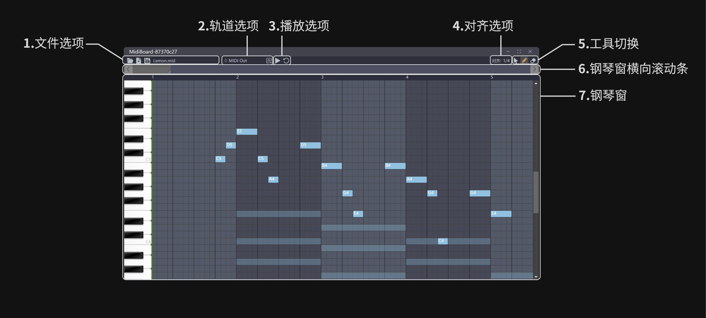
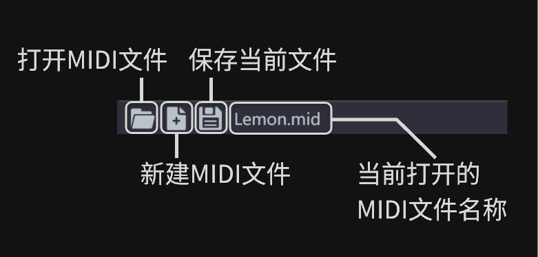

# 🎹 MIDI Board

## 插件简介

MIDI Board is a Netless app for Musician, MIDI maker and Music educator.

MIDI Board是一个适用于声网 Netless互动白板的插件，为音乐人、MIDI制作者以及音乐教育工作者提供MIDI文件的编辑与预览。通过本插件，可以实现多端、多人协同的MIDI编、作曲工作并导出，也可用于线上的音乐相关教学。

## 快速体验

1. 访问[声网Workshop](https://workshop.netless.link/)获取临时配置环境用于测试

2. 将本仓库clone到本地并进入根目录
    ```
    git clone https://github.com/CorpDreams/midi-board.git
    cd midi-board
    ```

3. 复制根目录下的`.env.example`并重命名为`.env`后，分别填写文件中的`VITE_APPID`, `VITE_ROOM_UUID` 和 `VITE_ROOM_TOKEN`为刚刚获取的临时环境

    也可直接使用以下测试用环境（不保证最新可用）：
    ```
    # Whiteboard SDK App ID
    VITE_APPID=ss4WoMf_EeqfCXcv33LmiA/izfIC88inXYJKw

    # Whiteboard Room UUID
    VITE_ROOM_UUID=aea16cd0035d11edb96c9b6e4baebda2

    # Whiteboard Room Token
    VITE_ROOM_TOKEN=NETLESSROOM_YWs9VWtNUk92M1JIN2I2Z284dCZleHBpcmVBdD0xNjYwMzg1NjQxNjk0Jm5vbmNlPWFlYmVkZmUwLTAzNWQtMTFlZC04OWQxLTNmZjQ1Mzc3YzYxNyZyb2xlPTEmc2lnPTY5OWI4ODQwYWI4MGJkNmRlOGJhNWJkYTdiZjExNzUwMDBiMTg1ZjdkNmVlZTY3Y2I1ZjRlZDZiNmYzZjAyMDAmdXVpZD1hZWExNmNkMDAzNWQxMWVkYjk2YzliNmU0YmFlYmRhMg
    ```

4. 在根目录使用命令行运行以下命令

    ``` sh
    npm install
    npm start
    ```

    运行完成后浏览器会自动打开本地服务器URL（如果没有请手动[访问](http://localhost:3000)，默认端口为3000），此时可看到白板应用demo已启动，点击右侧工具栏最后一个按钮打开插件列表，点击其中的`MidiBoard`即可使用本插件~

## 快速入门



1. 打开一个MIDI文件（可使用项目源目录的`examples`文件夹中的示例MIDI文件）。

    

2. 点击`播放`按钮，或直接使用`空格`快捷键播放MIDI文件。

    

3. 直接使用鼠标**按住并拖动**钢琴窗中的音符**中部**以改变*音高*及*位置*。

    

4. 直接使用鼠标**按住并拖动**钢琴窗中的音符**尾部**以改变音符的*持续时长*。

    

5. 点击右上角`铅笔`按钮，或直接使用`P`快捷键切换到铅笔工具。使用该工具在钢琴窗中**点击并拖动**以画出特定时长的音符。

    

6. 点击右上角`橡皮擦`按钮，或直接使用`E`快捷键切换到橡皮擦工具。使用该工具在钢琴窗中**点击**或**拖动**以删除鼠标路径经过的音符。

    

7. 再次点击已选中工具，或点击`鼠标`按钮可切换回鼠标。

8. 将鼠标移至`对齐`处并从下拉菜单中选择所需的值并点击以切换音符操作的对齐模式。

    

9. 将鼠标移至`时间轴`处，使用鼠标滚轮可以调整显示范围的大小，也可通过拖拽上方横向滚动块的**尾部**调整。

    
    

10. 鼠标在`时间轴`上点击时，可以将播放进度调整至点击位置对应时间

    

11. 拖拽上方横向滚动块**中部**可以调整显示区域（显示位置），注意：在正在播放时拖动，会因为播放进度的更新而导致位置跳动（因设置为播放时播放进度要始终显示在可见区域内）

    

12. 将鼠标移至`轨道列表`处从下拉菜单中选择所需的轨道并点击以切换。如只有单一轨道则不会出现下拉菜单，此时可以点击右侧新建轨道按钮新建一条轨道并添加音符。点击下拉菜单中轨道后的`×`按钮可删除对于轨道。

    

13. 点击`保存文件`按钮保存修改后的文件到本地。

**功能详细介绍见下一章节`功能详解`**

## 功能详解

### 1. 文件选项



初次打开插件时，文件名称处会显示`请打开或新建MIDI文件`，请点击`打开MIDI文件`或`新建MIDI文件`按钮开始使用插件。项目源目录的`examples`文件夹中提供了几个MIDI文件可供使用，以下是部分文件名及可用于测试的功能：
```
本草纲目.mid  多轨道MIDI文件编辑
野蜂飞舞.mid  MIDI音频预览
Lemon.mid    简单MIDI编辑与续写

*感谢MidiShow网站用户提供用于测试的MIDI文件
```

也可以点击`新建MIDI文件`按钮从零开始编曲！