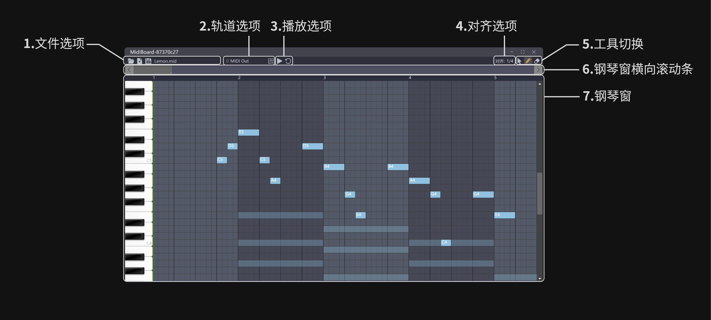
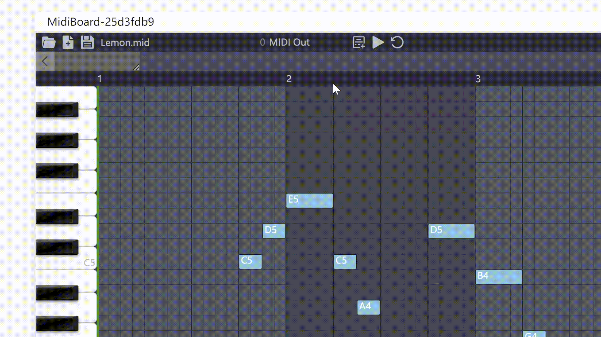
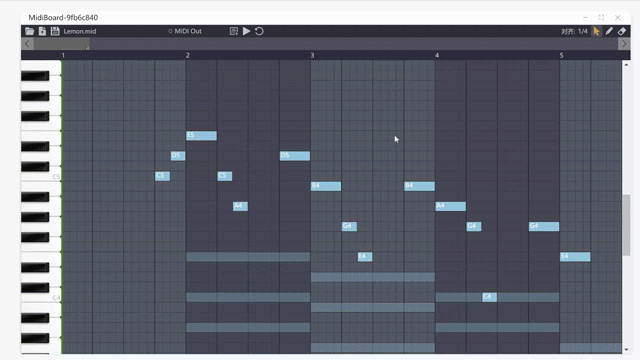
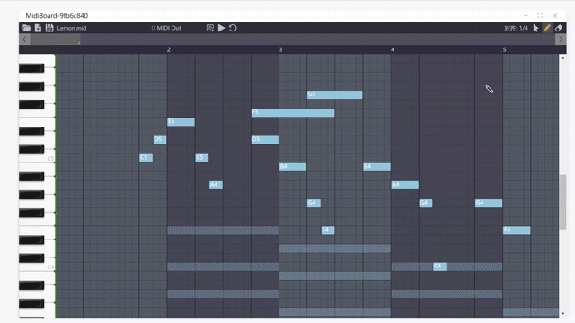
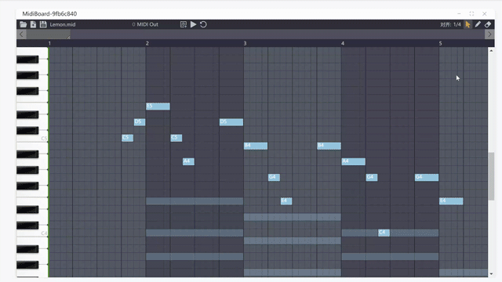
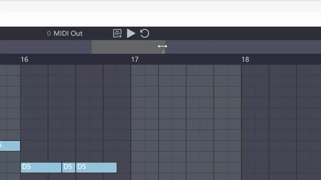
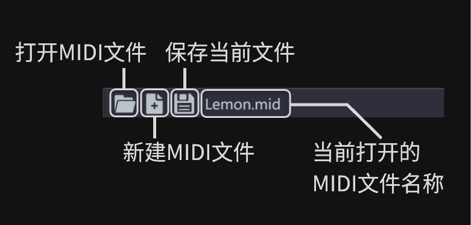
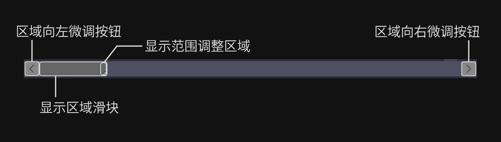
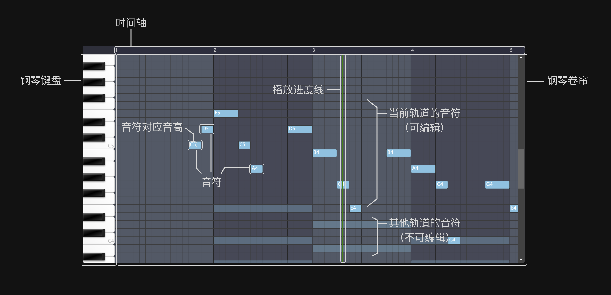

# 🎹 MIDI Board

## 插件简介

MIDI Board is a Netless app for Musician, MIDI maker and Music educator.

MIDI Board是一个适用于声网 Netless互动白板的插件，为音乐人、MIDI制作者以及音乐教育工作者提供MIDI文件的编辑与预览。通过本插件，可以实现多端、多用户协同的MIDI编、作曲工作并导出，也可用于线上的音乐相关教学。

## 安装方法

1. 访问[声网Workshop](https://workshop.netless.link/)获取临时配置环境用于测试

2. 将本仓库clone到本地并进入根目录
    ```
    git clone https://github.com/CorpDreams/app-midi-board.git
    cd app-midi-board
    ```

3. 复制根目录下的`.env.example`并重命名为`.env`后，分别填写文件中的`VITE_APPID`, `VITE_ROOM_UUID` 和 `VITE_ROOM_TOKEN`为刚刚获取的临时环境

    也可直接使用以下测试用环境（不保证最新可用）：
    ```
    # Whiteboard SDK App ID
    VITE_APPID=ss4WoMf_EeqfCXcv33LmiA/izfIC88inXYJKw

    # Whiteboard Room UUID
    VITE_ROOM_UUID=c1063fe01d4311ed924cff6ad50661b2

    # Whiteboard Room Token
    VITE_ROOM_TOKEN=NETLESSROOM_YWs9VWtNUk92M1JIN2I2Z284dCZleHBpcmVBdD0xNjYzMjMzMjM1OTE2Jm5vbmNlPWMxMmE5MGMwLTFkNDMtMTFlZC1iZWMyLWNiNTUzMjEwMzFlYSZyb2xlPTEmc2lnPWU0MTVmMmZlM2Y0OWUzYTM0YmYyM2IyODIyNDYyOGJkYmQ0MDM2MjNkZDVjODMzNjhhNmY2MTI5MWYyYWY0OTMmdXVpZD1jMTA2M2ZlMDFkNDMxMWVkOTI0Y2ZmNmFkNTA2NjFiMg
    ```

4. 在根目录使用命令行运行以下命令

    ``` sh
    npm install
    npm start
    ```

    运行完成后浏览器会自动打开本地服务器URL（如果没有请手动[访问](http://localhost:3000)，默认端口为3000），此时可看到白板应用demo已启动，点击右侧工具栏最后一个按钮打开插件列表，点击其中的`MidiBoard`即可使用本插件~

    ***推荐最大化插件窗口以获得最佳体验**

## 快速入门

*以下内容包含GIF及图片，为提高加载速度，推荐使用科学上网。*



1. 打开一个MIDI文件（可使用项目源目录的`examples`文件夹中的示例MIDI文件）。

    

2. 点击`播放`按钮，或直接使用`空格`快捷键播放MIDI文件。

    

3. 直接使用鼠标**按住并拖动**钢琴窗中的音符**中部**以改变*音高*及*位置*。

    

4. 直接使用鼠标**按住并拖动**钢琴窗中的音符**尾部**以改变音符的*持续时长*。

    

5. 点击右上角`铅笔`按钮，或直接使用`P`快捷键切换到铅笔工具。使用该工具在钢琴窗中**按住并拖动**以画出特定时长的音符。

    

6. 点击右上角`橡皮擦`按钮，或直接使用`E`快捷键切换到橡皮擦工具。使用该工具在钢琴窗中**点击**或**拖动**以删除鼠标路径经过的音符。

    

7. 再次点击已选中工具，或点击`鼠标`按钮可切换回鼠标。

8. 将鼠标移至`对齐`处并从下拉菜单中选择所需的值并点击以切换音符操作的对齐模式。

    

9. 将鼠标移至`时间轴`处，使用鼠标滚轮可以调整显示范围的大小，也可通过拖拽上方横向滚动块的**尾部**调整。

    
    

10. 鼠标在`时间轴`上点击时，可以将播放进度调整至点击位置对应时间

    

11. 拖拽上方横向滚动块**中部**可以调整显示区域（显示位置），注意：在正在播放时拖动，会因为播放进度的更新而导致位置跳动（因设置为播放时播放进度要始终显示在可见区域内）

    

12. 将鼠标移至`轨道列表`处从下拉菜单中选择所需的轨道并点击以切换。如只有单一轨道则不会出现下拉菜单，此时可以点击右侧新建轨道按钮新建一条轨道并添加音符。点击下拉菜单中轨道后的`×`按钮可删除对于轨道。

    

13. 点击`保存文件`按钮保存修改后的文件到本地。

**功能详细介绍见下一章节[`功能详解`](#功能详解)**

## 功能详解

### 1. 文件选项



初次打开插件时，文件名称处会显示`请打开或新建MIDI文件`，请点击`打开MIDI文件`或`新建MIDI文件`按钮开始使用插件。项目源目录的`examples`文件夹中提供了几个MIDI文件可供使用，以下是部分文件名及可用于测试的功能：
```
本草纲目.mid  多乐器测试及多轨道MIDI文件编辑
野蜂飞舞.mid  MIDI音频预览
Lemon.mid    简单MIDI编辑与续写

*感谢MidiShow网站用户提供用于测试的MIDI文件
```

也可以点击`新建MIDI文件`按钮从零开始编曲！

### 2. 轨道选项


将鼠标移动到`当前轨道名称`处可展开`轨道下拉列表`，在下拉列表中点击其中轨道选项可切换到所点击的轨道，将鼠标移到轨道选项上时会显示`删除轨道按钮`，点击该按钮可删除对应轨道（会有确认提醒）。

若所要删除的轨道是当前显示轨道，需先将轨道切换至其他轨道后，再在`轨道下拉列表`中点击删除按钮删除。

### 3. 播放选项

：播放/暂停按钮

：重新播放按钮

### 4. 对齐选项

将鼠标移到分数位置（即当前的对齐设置）上，会出现下拉菜单，可以在其中点击所想要设置的对齐。

对齐的分数的含义为，以一拍的`1/n`为最小单位对齐。

### 5. 工具切换

：切换为`箭头`工具（默认），选择该工具只可以修改已有音符

：切换为`铅笔`工具，使用该工具可以修改已有音符并绘制新音符

：切换为`橡皮擦`工具，使用该工具仅可以删除音符

**工具的使用见下一章节[`基础操作`](#基础操作)**

### 6. 钢琴窗横向滚动条



按住并左右拖动`显示区域滑块`的中部可以调节显示区域的位置，按住并作用拖动`显示区域滑块`的**尾部**可以调节显示范围的大小，滑块越长，显示范围越大。

进行音符绘制时，使用较小的显示范围可以更容易控制绘制的音符时长。

### 7. 钢琴窗



钢琴窗右侧每一行对应一个音高，每一个较粗且上方时间轴中带有数字的线分割的区域对应一个小节，时间轴上的数字为对应的小节号。每个小节根据MIDI文件的头部信息分为了对应数量的拍子（目前仅支持四一拍、四二拍、四三拍和四四拍），每一拍之间细线为根据对齐设置生成的分割线。

钢琴窗右侧每行的音高与其左侧钢琴键盘的按键的音高是对应的（以按键最小高度为准），右侧钢琴键盘点击可以听到对应音高的琴声。同时当调整音符音高时也能够预览对应音高的琴声。

用鼠标在时间轴上单击时，可以将播放进度调整至点击位置对应的时间。

在时间轴上使用滚轮同样可以调整显示范围的大小。

**对音符的操作见下一章节[`基础操作`](#基础操作)**

## 基础操作

### 1. 绘制音符

切换为`铅笔`工具，用鼠标在钢琴窗中空白区域**按下**并**拖动**，直至绘制出的音符时长达到所需。

### 2. 擦除音符

切换为`橡皮擦`工具，用鼠标在钢琴窗中**点击**单个音符以删除，或是鼠标**按住**并在钢琴窗中**拖动**，此时将删除所有路径经过的音符。

### 3. 修改音符音高及开始时间

切换为`铅笔`工具或`箭头`工具，用鼠标**按住**钢琴窗中的音符**中部**（即鼠标样式为四向箭头的位置）并移动鼠标直至音符处于所需的音高以及开始时间后松开鼠标。

### 4. 修改音符持续时间

切换为`铅笔`工具或`箭头`工具，用鼠标**按住**钢琴窗中的音符**尾部**（即鼠标样式为左右箭头的位置）并**左右**移动鼠标直至音符的长度达到所需的持续时间后松开鼠标。